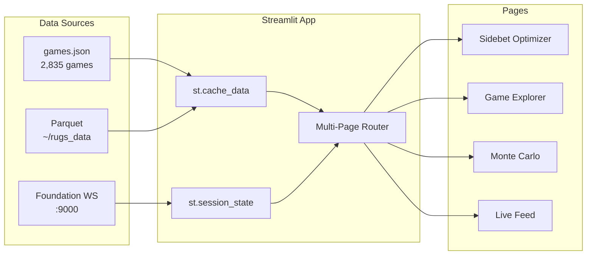

# TGOES - Streamlit Data Exploration System

**Plan ID:** streamlit-exploration-system
**Date:** 2026-01-19
**Status:** DESIGN PHASE

---

## Decision: Streamlit Over Jupyter/HTML

**Why Streamlit:**
- Real interactive UI without widget rendering issues
- Multi-page apps with automatic navigation
- No visible code - just dashboards
- Hot reload during development
- Plotly/Altair integration out of the box
- Session state for complex workflows
- Can embed in iframe or deploy standalone

**Killed:**
- Jupyter notebooks (clunky, code-heavy, widget issues)
- Standalone HTML artifacts (limited interactivity without backend)
- Voila (just a bandaid on Jupyter)

---

## System Architecture

```
src/apps/
├── Home.py                          # Landing page, system overview
└── pages/
    │
    │── 1_📊_Sidebet_Optimizer.py    # ✅ BUILT - Survival analysis
    │
    ├── 2_🎮_Game_Explorer.py        # Browse 2,835 games
    │   ├── Filter by duration, peak, date
    │   ├── Individual game replay
    │   └── Price chart with annotations
    │
    ├── 3_🎲_Monte_Carlo.py          # Strategy simulation
    │   ├── 8 preset strategies
    │   ├── Custom strategy builder
    │   ├── Bankroll evolution charts
    │   └── Risk metrics (VaR, Sharpe, etc.)
    │
    ├── 4_📈_Prediction_Engine.py    # Bayesian forecaster
    │   ├── Real-time predictions (Foundation WS)
    │   ├── Regime detection display
    │   └── Confidence intervals
    │
    ├── 5_🧪_Backtest.py             # Historical strategy testing
    │   ├── Select strategy + parameters
    │   ├── Run against historical data
    │   └── Trade-by-trade breakdown
    │
    ├── 6_🔴_Live_Feed.py            # Foundation Service integration
    │   ├── WebSocket connection status
    │   ├── Real-time game state
    │   └── Live prediction overlay
    │
    ├── 7_🔬_PRNG_Analysis.py        # Seed/entropy exploration
    │   ├── Seed heatmap
    │   ├── Byte position analysis
    │   └── CTF status dashboard
    │
    ├── 8_📚_Knowledge_Base.py       # RAG query interface
    │   ├── Search game mechanics docs
    │   ├── Query rugs-expert MCP
    │   └── Strategy documentation
    │
    └── 9_⚙️_Settings.py             # Configuration
        ├── Foundation Service URL
        ├── Theme selection
        └── Data source selection
```

---

## Shared Components

```
src/apps/
├── components/
│   ├── charts.py           # Reusable Plotly chart functions
│   ├── metrics.py          # Styled metric cards
│   ├── filters.py          # Common filter widgets
│   └── theme.py            # Catppuccin colors, CSS
│
├── models/
│   ├── survival.py         # BayesianSurvivalModel
│   ├── forecaster.py       # BayesianForecaster (from PRNG CRAK)
│   ├── monte_carlo.py      # Simulation engine
│   └── strategies.py       # Strategy definitions
│
└── data/
    ├── loader.py           # Load from games.json / Parquet
    └── websocket.py        # Foundation Service client
```

---

## Data Flow



---

## Implementation Phases

### Phase 1: Core Infrastructure (Current)
- [x] Sidebet Optimizer page
- [ ] Home.py landing page
- [ ] Shared theme/components
- [ ] Data loader abstraction

### Phase 2: Exploration Tools
- [ ] Game Explorer (browse/filter/replay)
- [ ] PRNG Analysis (seed heatmap)
- [ ] Knowledge Base (RAG interface)

### Phase 3: Simulation & Strategy
- [ ] Monte Carlo simulation
- [ ] Strategy Builder
- [ ] Backtest engine

### Phase 4: Live Integration
- [ ] Foundation Service WebSocket
- [ ] Real-time prediction display
- [ ] Live trading controls (read-only display)

---

## Run Command

```bash
cd /home/devops/Desktop/VECTRA-PLAYER
source .venv/bin/activate
streamlit run src/apps/Home.py --server.port 8501
```

Access at: **http://localhost:8501**

---

## Design Principles

1. **No code visible** - Users see dashboards, not Python
2. **Instant feedback** - Sliders/inputs update charts immediately
3. **Consistent theme** - Catppuccin Mocha everywhere
4. **Modular pages** - Each page is self-contained
5. **Shared state** - Complex workflows persist across pages
6. **Data cached** - No reloading on every interaction

---

## Migration Notes

### From PRNG CRAK Python Engine
- `bayesian_forecaster.py` → `src/apps/models/forecaster.py`
- `equilibrium_tracker.py` → `src/apps/models/regime.py`
- `game_simulator.py` → `src/apps/models/simulator.py`

### From JS Prediction Artifact
- **DEPRECATED** - All prediction logic moves to Python/Streamlit

### From Recording UI Explorer
- Monte Carlo logic → `src/apps/pages/3_Monte_Carlo.py`
- Strategy presets → `src/apps/models/strategies.py`

### From Explorer V2 (D3.js)
- Seed heatmap → `src/apps/pages/7_PRNG_Analysis.py`
- Timeline charts → `src/apps/pages/2_Game_Explorer.py`

---

*Updated 2026-01-19 - Pivot to Streamlit*
